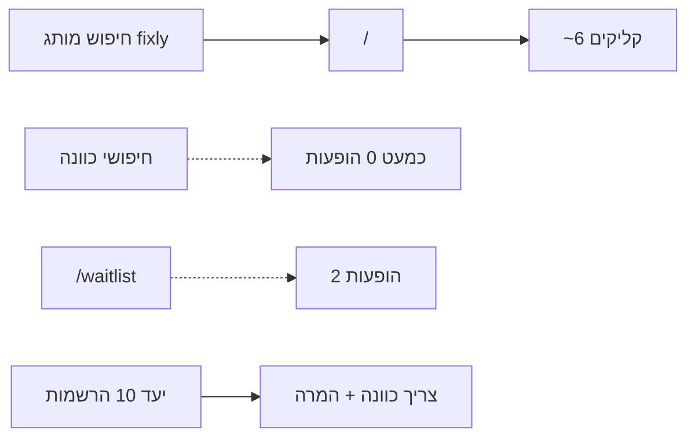

# תוכנית צמיחה אורגנית מ־Google Search Console

מבוסס על ייצוא GSC (חיפוש אינטרנט, ~3 חודשים אחרונים) + מה שכבר נבנה ב־Fixly  
(הרשמה אמיתית, יעד 10 נרשמים, דפי services עם noindex בלי ערך, מטא marketplace).

---

## 1) מה הנתונים אומרים (אבחון)

| מדד | ערך | משמעות |
|-----|-----|--------|
| קליקים | **6** | כמעט אין תנועה אורגנית |
| הופעות | **~28** | האתר כמעט לא מופיע מחוץ למותג |
| CTR כללי | גבוה יחסית כשמופיעים | הבעיה היא **חשיפה**, לא רק CTR |
| שאילתות | `fixly`, `flixly`, `fixly.ar`, `fix ly` | **רק מותג / שגיאות כתיב** — אפס כוונת שירות |
| דפים | `/` = כל 6 הקליקים; `/waitlist` = 2 הופעות 0 קליקים | ההרשמה כמעט לא מדורגת |
| ישראל | 6 קליקים, מקום ממוצע **2.59** | מותג חזק בארץ |
| ארה״ב | 6 הופעות, מקום **31** | רעש / geo — לא שוק יעד |
| נייד | 5/6 קליקים, CTR 31%, מקום **2.7** | מובייל קודם |
| דסקטופ | מקום **17** | חלש יותר |

**מסקנה אחת:** גוגל מכיר את המותג Fixly, אבל **לא** מציג אתכם על חיפושי כוונה  
(«אינסטלטור בתל אביב», «בעל מקצוע עד הבית» וכו׳). בלי זה אין סולם לחשיפה גדולה  
ולא מספיק לידים ליעד 10 הנרשמים.

---

## 2) חיבור למה שכבר עשינו

| נכס קיים | איך זה נכנס לתוכנית |
|----------|---------------------|
| `/waitlist` מאוחד + שמירה אמינה | יעד ההמרה של כל תנועה אורגנית |
| יעד 10 ב־`/admin` | KPI ראשי לחודש — אורגני חייב להזין אותו |
| מטא `/` = marketplace (לא «הרשמה מוקדמת») | תואם למה ש־Googlebot רואה היום |
| `/services/[city]/[category]` + noindex בלי ערך אמיתי | לא מרעילים אינדקס בדפי דמו — פותחים רק עם ערך |
| `ORGANIC_CONTENT_PLAN.md` | שלב א׳/ב׳ נשארים — עכשיו מחוברים לנתוני GSC |
| UTM קנוני + חסימת localhost ב־GA | מדידה נקייה של organic → signup |
| Geo gate + Googlebot allow | כבר עובד לבוט; לא לפתוח שוק חו״ל |

---

## 3) יעדים (90 יום)

לא «תמיד מקום 1 בכל מילה» — זה לא ריאלי בלי תוכן ואספקה. יעדים מדידים:

| שלב | חלון | יעד GSC | יעד מוצר |
|-----|------|---------|----------|
| **A — מותג + בסיס** | 30 יום | מקום ממוצע ≤ **1.5** על `fixly`; ≥50 הופעות/שבוע | ≥5 הרשמות אמיתיות (מתוך יעד 10) |
| **B — כוונה ראשונה** | 60 יום | ≥3 שאילתות כוונה עם הופעות (לא מותג); `/waitlist` ≥20 הופעות | 10 הרשמות בחודש הנוכחי |
| **C — חשיפה** | 90 יום | ≥200 הופעות/שבוע; ≥1 דף services באינדקס עם קליקים | משפך organic → waitlist יציב |

---

## 4) תוכנית ביצוע — 4 שכבות

### שכבה 1 — טכני (חובה לפני תוכן המוני)

1. **GSC Hygiene**
   - URL Inspection + Request indexing: `/`, `/waitlist`, `/about`
   - לוודא sitemap submitted; להסיר / לדחות URLs של `*.vercel.app` אם מופיעים
   - לסמן שאילתות שגויות (`flixly`) — לא להשקיע בהן תוכן; אפשר `fixly` בולט ב־title
2. **מותג במקום 1**
   - `/` title/H1 עם «Fixly» ראשון (כבר קרוב)
   - Organization JSON-LD + sameAs (אם יש רשתות)
   - דף `/about` קצר עם סיפור מותג + קישור להרשמה
3. **`/waitlist` לאינדקס אמיתי**
   - title ייחודי עם מילות כוונה קלות: «הרשמה ל-Fixly — לקוחות ובעלי מקצוע»
   - FAQ JSON-LD כבר קיים — לוודא שאלות עם מילות חיפוש אמיתיות
   - Internal links מ־`/` ו־`/about` ו־footer
4. **מובייל־ראשון**
   - Core Web Vitals / LCP בדף הבית וב־waitlist (רוב הקליקים מנייד)
5. **לא** לרדוף אחרי הופעות מארה״ב — geo נשאר ישראל

### שכבה 2 — מילות כוונה (רק עם ערך)

עקרון מ־`ORGANIC_CONTENT_PLAN`: **אין דפי תבנית ריקים**.

**Cluster 1 — מותג + קטגוריה כללית** (מיידי, בלי תלות באספקה)
- דף תוכן קצר (לא services ריק): למשל `/guide/how-fixly-works` או הרחבת `/about`
- מילים: «בעל מקצוע עד הבית», «הזמנת בעל מקצוע», «תיקונים בבית ישראל»

**Cluster 2 — עיר × מקצוע** (רק כשיש אספקה/ביקוש)
- תנאי פתיחה לאינדקס (קיים בקוד): בעל מקצוע אמיתי **או** ≥3 הרשמות לקוח לעיר
- סדר עדיפות לפי יעד 10 + גיוס:
  1. תל אביב — אינסטלציה / חשמל / מיזוג  
  2. ירושלים — אותן קטגוריות  
  3. חיפה
- כל דף services באינדקס: H1 ברור, CTA ל־`/waitlist` **ו־** `/request/new` לפי מצב הפתיחה

**Cluster 3 — בעלי מקצוע**
- `/waitlist?audience=professional` כנחיתה ל־outreach
- מילים: «לידים לבעלי מקצוע», «עבודות לאינסטלטורים» — רק אם יש דף ייעודי אמיתי (לא ספאם)

### שכבה 3 — המרה (אורגני → יעד 10)

כל ביקור אורגני חייב מסלול ברור להרשמה:

1. `/` → CTA «הצטרפו / הרשמה» → `/waitlist`
2. דפי services בלי אספקה → CTA הרשמה (כבר בקוד)
3. אחרי הרשמה → שיתוף WhatsApp (כבר קיים) עם UTM `medium=share`
4. ב־GA4 / admin: פילטר `utm_medium=organic` + ספירת `signupGoal`

מדידה שבועית ב־`/admin`:
- הרשמות השבוע / יעד 10
- שאילתות חדשות ב־GSC (צילום מסך / ייצוא)

### שכבה 4 — חשיפה מחוץ לגוגל (מאיץ)

אורגני לבד לא יגיע ל־10 בחודש מהר. בשילוב:

| ערוץ | פעולה | קישור קנוני |
|------|--------|-------------|
| WhatsApp outreach ל־prospects | הודעות עם JOIN_URL | `/waitlist?audience=professional&utm_…` |
| Meta paid | קמפיין קטן ל־waitlist | `utm_source=meta&utm_medium=paid` |
| שיתוף אחרי הרשמה | ויראליות מקומית | `utm_medium=share` |
| Google Business / מפות (אם רלוונטי לעסק) | נוכחות מותג מקומית | קישור לאתר |
| שיתופי פעולה Bamakor / ניהול בניינים | ביקוש אמיתי + אזכורים | כניסה למוצר / waitlist |

---

## 5) מפת מילים — עדיפות

### עכשיו (מותג) — להגן ולחזק
- fixly, fixly ישראל, fixly בעלי מקצוע

### גל 1 (כוונה כללית) — תוכן + מטא
- בעל מקצוע עד הבית  
- הזמנת בעל מקצוע  
- תיקונים בבית  
- אפליקציה לבעלי מקצוע / פלטפורמה לבעלי מקצוע  

### גל 2 (כוונה מקומית) — רק עם ערך אמיתי
- אינסטלטור תל אביב / ירושלים / חיפה  
- חשמלאי …  
- מזגנים תיקון …  

### לא להשקיע
- flixly / שיבושי הקלדה  
- דירוג בארה״ב  
- 48 דפי services ריקים

---

## 6) לוח זמנים מוצע

| שבוע | פעולות |
|------|--------|
| 1 | Indexing `/` + `/waitlist`; חיזוק מטא מותג; לינקים פנימיים; בדיקת GSC Coverage |
| 2 | שיפור `/about` + FAQ waitlist לכוונה; CTA אורגני ברור מ־home |
| 3–4 | פתיחת 1–3 דפי services **רק** אם יש אספקה/ביקוש; outreach מקבילי ליעד 10 |
| 5–8 | הרחבת cluster לפי הרשמות אמיתיות; מעקב שאילתות כוונה ב־GSC |
| 9–12 | הכפלת דפים עם קליקים; אופטימיזציית CTR (titles) לדפים שמדורגים 5–15 |

---

## 7) מה כן / לא לעשות

**כן**
- לחבר כל עמוד שמקבל הופעות ל־`/waitlist`
- לפתוח SEO מקומי רק עם ערך אמיתי
- למדוד organic → signup לצד יעד 10

**לא**
- להבטיח «תמיד מקום 1» על כל מילת מפתח
- להציג פרופילי דמו כתוכן אורגני
- לערבב prospects עם הרשמות
- לייצר עשרות דפי תבנית ריקים בשביל «חשיפה»

---

## 8) קבצים / נכסים רלוונטיים בקוד

- [`docs/ORGANIC_CONTENT_PLAN.md`](./ORGANIC_CONTENT_PLAN.md) — כללי ערך אמיתי  
- [`docs/MONTHLY_SIGNUP_GOAL.md`](./MONTHLY_SIGNUP_GOAL.md) — יעד 10  
- [`docs/ACQUISITION_URLS.md`](./ACQUISITION_URLS.md) — URLs + UTM  
- [`docs/GOOGLE_SEARCH_CONSOLE.md`](./GOOGLE_SEARCH_CONSOLE.md) — חיבור GSC (לעדכן אחרי התוכנית)  
- [`app/services/[city]/[category]/page.tsx`](../app/services/[city]/[category]/page.tsx) — noindex בלי ערך  
- [`lib/growth/monthly-signup-goal.ts`](../lib/growth/monthly-signup-goal.ts) — מעקב admin  

---

## 9) יישום בקוד (סטטוס)

1. ✅ מטא + FAQ של `/waitlist` לכוונה (בלי לשבור מותג)  
2. ✅ internal links + CTA אורגני ב־`HomeScreen` (`home-waitlist-cta`)  
3. ✅ הרחבת `/about` כדף מותג/כוונה + JSON-LD  
4. ✅ צ׳קליסט שבועי: [`GSC_WEEKLY_CHECKLIST.md`](./GSC_WEEKLY_CHECKLIST.md)  
5. ✅ שער אינדקס services: בעל מקצוע אמיתי **או** ≥3 הרשמות לקוח לעיר — [`lib/seo/has-seo-value.ts`](../lib/seo/has-seo-value.ts)

**לא נפתח דף services באינדקס** עד שעוברים את השער — אין תבניות ריקות.